<div align="center">

# UVP GB28181 Sim

**把手机变成一台 GB/T 28181-2022 国标摄像头**

[](https://opensource.org/licenses/MIT)
[]()
[](https://kotlinlang.org/)
[](https://www.jetbrains.com/compose-multiplatform/)

</div>

---

## 什么是 UVP

**UVP（Unified Video Platform，统一视频接入平台）** 是一套面向公共安全 / 智慧城市场景的国标视频接入平台，负责将海量前端摄像头通过 GB/T 28181 协议统一接入、管理与分发。

**UVP GB28181 Sim** 是 UVP 官方开源的配套调试工具——将 Android 手机模拟为一台完整的 GB/T 28181-2022 下级设备（IPC），可注册到任意国标上级平台进行联调测试，无需购买真实摄像头。

> v1.0 仅发布 Android。基于 Kotlin Multiplatform + Compose Multiplatform 构建，iOS 端代码骨架已就位，媒体线接入排期 v1.1。

---

## 为什么做这个

国标平台开发与测试面临一个共同痛点：

> **没有摄像头，就没法调。**

买一台合格的国标 IPC 动辄数百元，还要接线、配网、架设环境。出差在外或居家办公时，一切更是无从下手。

而市面上现有的模拟器工具：

| 问题 | 现状 |
|---|---|
| 全部闭源 | 遇到平台兼容性问题只能干等，无法定制协议细节 |
| 协议日志薄弱 | 调试看不到 SIP 报文，只能抓包猜 |
| 主动业务缺失 | 只能被动等平台拉流，无法主动上报报警 / 抓拍 / 位置 |
| 工具陈旧 | 缺少 GB/T 28181-2022 新增字段与命令的覆盖 |

**UVP GB28181 Sim 的回答：**

- **随身携带的虚拟摄像头** — 手机即设备，零硬件依赖
- **完整协议覆盖** — 实现 GB/T 28181-2022 设备端 60+ 功能点
- **可视化协议日志** — 每一条 SIP 报文结构化展示，调试不靠蒙
- **主动业务完备** — 报警上报、抓拍、GPS 位置、录像通知全支持
- **完全开源** — 遇到兼容性问题，直接改

---

## 能力矩阵

> ✅ 已实现 · ⚠️ 半完成 · ❌ 未实现 · 🚫 明确不做

### 注册与信令

| 功能 | 状态 |
|---|---|
| REGISTER / Digest MD5 鉴权 / 注销 | ✅ |
| 心跳保活 + 超时自动重注册（指数退避） | ✅ |
| SIP over UDP / TCP | ✅ |
| OPTIONS 探活响应 | ✅ |

### 实时音视频

| 功能 | 状态 |
|---|---|
| INVITE 点播 / BYE 停流 / CANCEL | ✅ |
| H.264 / H.265 视频编码 + PS 封装 | ✅ |
| G.711A / AAC 音频复用 | ✅ |
| RTP over UDP / TCP（RFC 4571） | ✅ |
| 强制关键帧（IFameCmd） | ✅ |

### 历史录像与回放

| 功能 | 状态 |
|---|---|
| 录像列表查询（RecordInfo） | ✅ |
| 历史回放流推送 | ✅ |
| 倍速播放（0.25× – 4×） | ✅ |
| 录像下载（Download INVITE） | ✅ |

### 设备查询（平台 → 设备）

| 功能 | 状态 |
|---|---|
| 目录查询（Catalog，GB-2022 全字段） | ✅ |
| 设备信息 / 状态查询 | ✅ |
| 设备配置查询（BasicParam / VideoParamOpt） | ✅ |
| 预置位 / 看守位查询 | ✅ |
| 巡航轨迹列表 / 详情查询 | ✅ |
| 存储卡状态查询 | ✅ |
| PTZ 精准状态查询（GB-2022） | ✅ |
| 报警状态查询 | ✅ |
| GB-2016 / GB-2022 双版本切换 | ✅ |

### 设备控制（平台 → 设备）

| 功能 | 状态 |
|---|---|
| 云台控制（PTZCmd 8 字节，含聚焦/光圈） | ✅ |
| 预置位 CRUD（设置 / 调用 / 删除） | ✅ |
| 看守位设置与自动归位 | ✅ |
| 精确云台控制（GB-2022 PTZPreciseCtrl） | ✅ |
| 巡航轨迹控制（增点 / 删点 / 速度 / 停留 / 启动） | ✅ |
| 布防 / 撤防 / 报警复位 | ✅ |
| 远程重启（复用开机自检动画） | ✅ |
| 远程录像开始 / 停止 | ✅ |
| 平台下发抓拍 | ✅ |
| 拖框放大 / 缩小 | ✅ |
| 辅助控制（雨刷 / 红外 / 加热 / 除雾 / 制冷） | ✅ |
| 在线升级（带 4 步进度回报 NOTIFY） | ✅ |
| 格式化 SD 卡（协议合规，不做业务） | ✅ |
| 目标跟踪（鱼眼/球机专属，手机无场景） | ✅ |

### 主动上报（设备 → 平台）

| 功能 | 状态 |
|---|---|
| 报警上报（Alarm Notify，9 字段全集） | ✅ |
| 抓拍 SIP 通知 + HTTP 图片上传 | ⚠️ |
| 移动设备 GPS 位置上报（周期 NOTIFY） | ✅ |
| 录像完成 / 异常通知（MediaStatus） | ✅ |

### 订阅与通知

| 功能 | 状态 |
|---|---|
| Catalog 订阅 + 增量 NOTIFY | ✅ |
| Alarm 报警事件订阅 | ✅ |
| MobilePosition 位置订阅 | ✅ |

### 语音对讲

| 功能 | 状态 |
|---|---|
| 语音广播（平台 → 设备，G.711A 下行） | ✅ |
| 双向语音对讲 | 🚫 |

---

## 截图

<table>
<tr>
<td align="center" width="33%"><b>主页 / 连接配置</b><br/>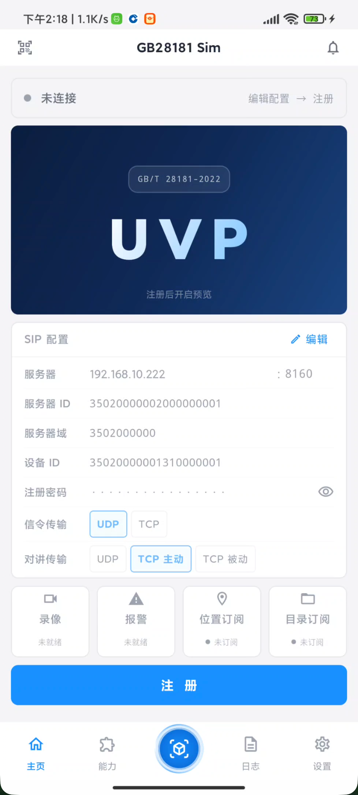</td>
<td align="center" width="33%"><b>模拟中心</b><br/>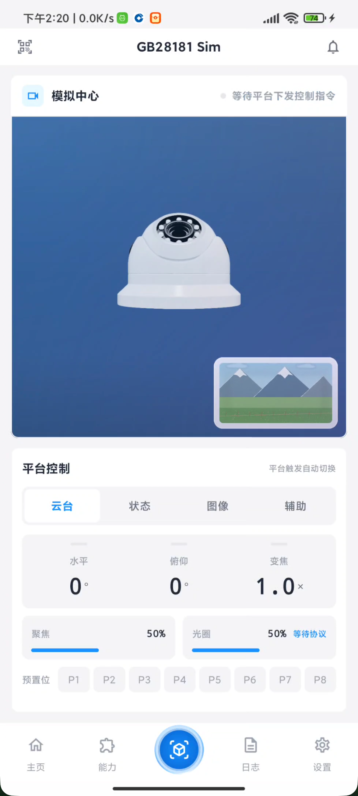</td>
<td align="center" width="33%"><b>能力中心</b><br/>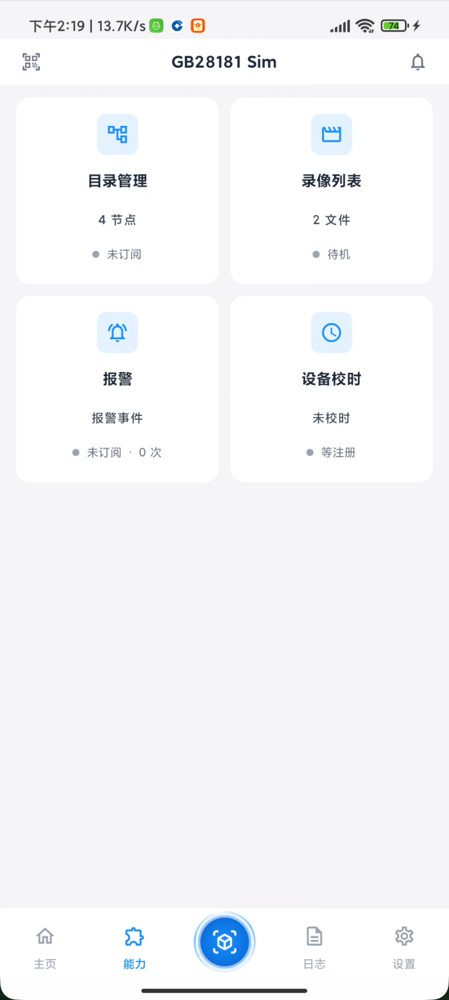</td>
</tr>
<tr>
<td align="center"><b>目录管理(虚拟通道树)</b><br/>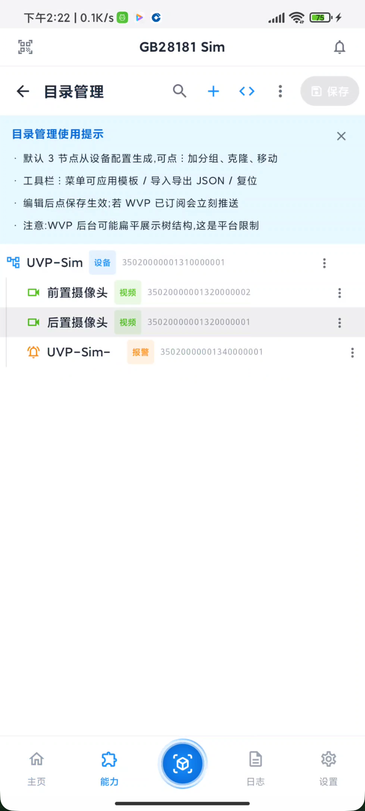</td>
<td align="center"><b>录像列表</b><br/>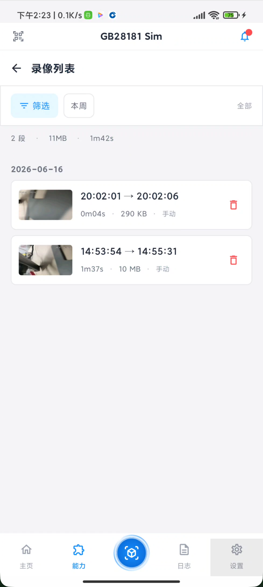</td>
<td align="center"><b>报警中心</b><br/>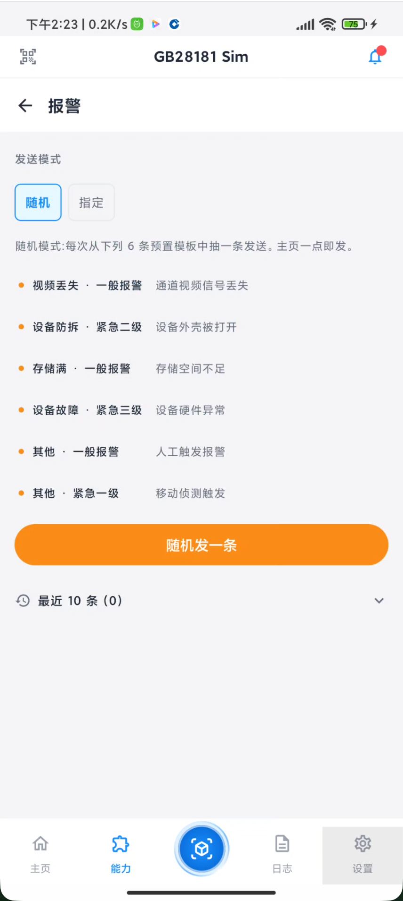</td>
</tr>
<tr>
<td align="center"><b>设备校时</b><br/>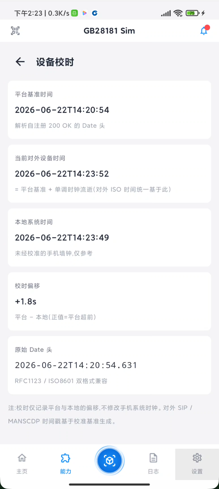</td>
<td align="center"><b>协议消息</b><br/>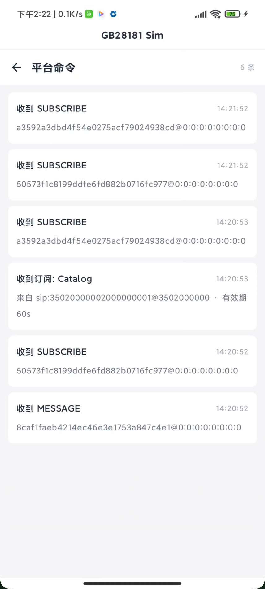</td>
<td align="center"><b>协议日志</b><br/>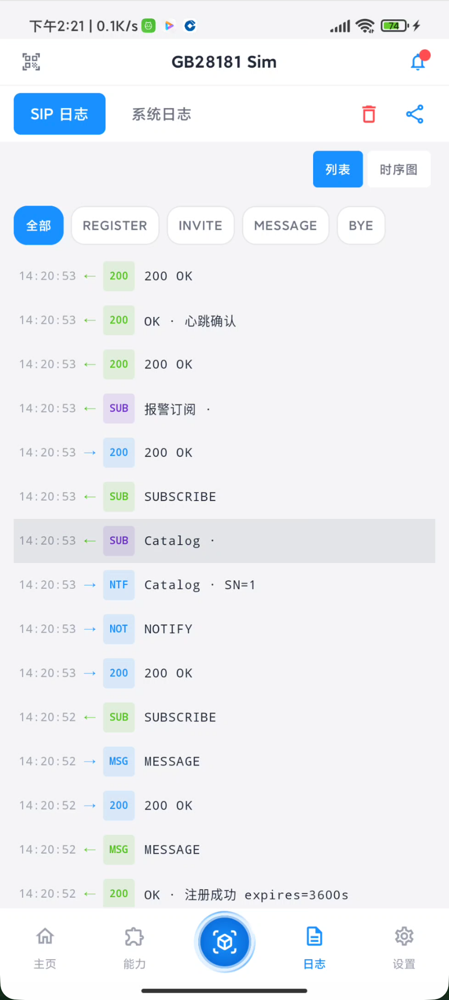</td>
</tr>
</table>

<details>
<summary>设置页(展开查看 5 张)</summary>

<table>
<tr>
<td align="center"><b>设置首页</b><br/>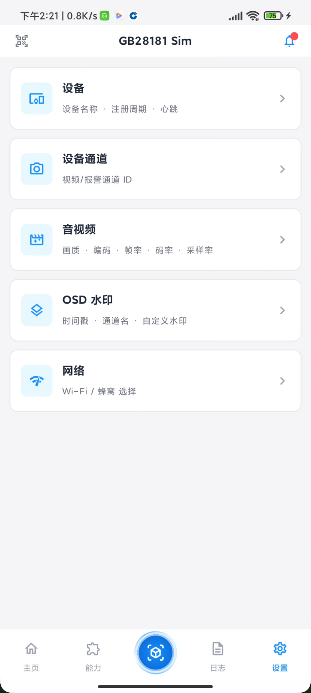</td>
<td align="center"><b>设备信息</b><br/>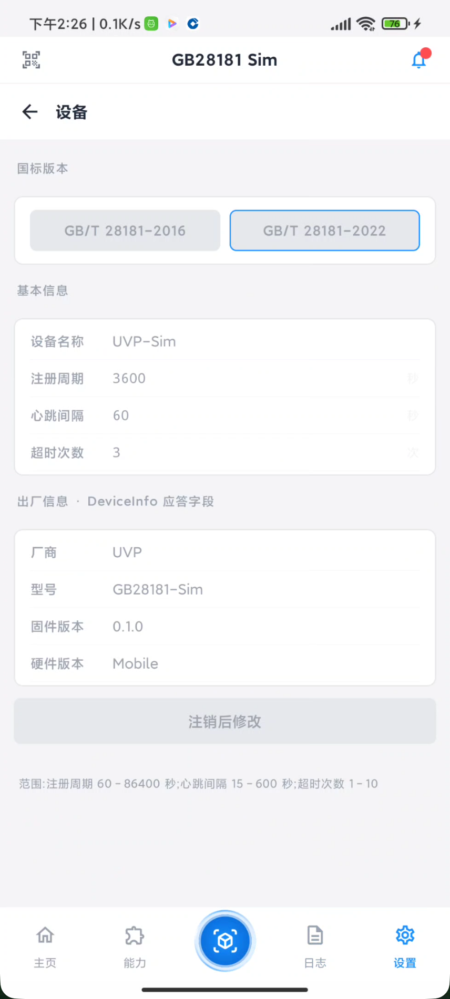</td>
<td align="center"><b>通道</b><br/>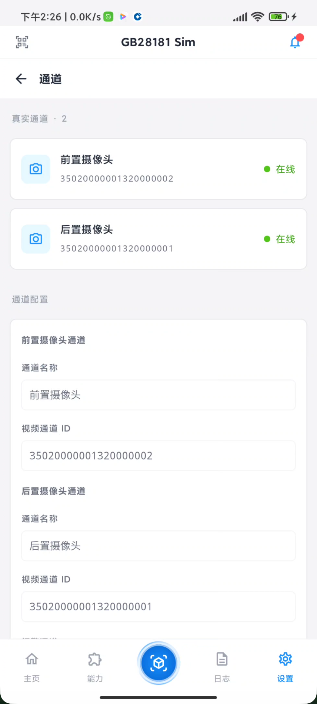</td>
</tr>
<tr>
<td align="center"><b>音视频</b><br/>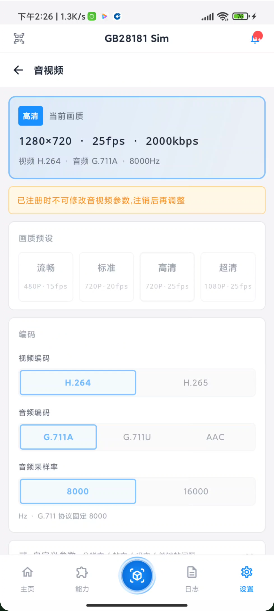</td>
<td align="center"><b>OSD 水印</b><br/>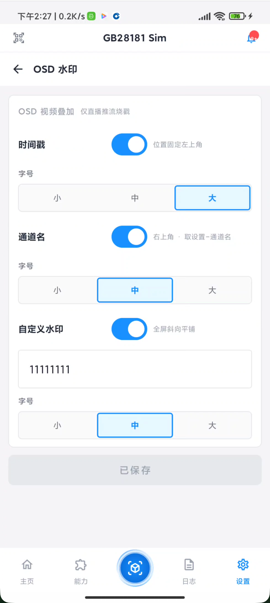</td>
<td align="center"><b>网络</b><br/>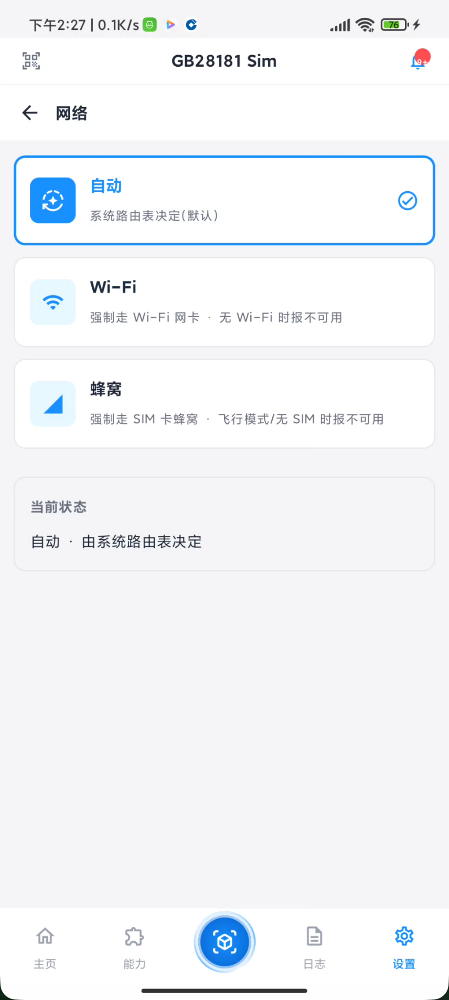</td>
</tr>
</table>

</details>

---

## 快速开始

### Android

从 [Releases](../../releases) 下载最新 APK 安装即可，无需 Root。

> 当前为 v1.0 首版，使用 debug 签名直接发布以方便调试与二次开发；上架公开商店前会切换 release 签名。

### 从源码构建

```bash
# 需要 JDK 17
export JAVA_HOME=/opt/homebrew/opt/openjdk@17

# Android 真机 / 模拟器
./gradlew :androidApp:installDebug

# 生成 release APK(已配置 release 签名)
./gradlew :androidApp:assembleRelease
# 产物: androidApp/build/outputs/apk/release/androidApp-release.apk
```

### 测试金字塔

项目采用三层测试金字塔(底厚顶尖):

```bash
export JAVA_HOME=/opt/homebrew/opt/openjdk@17

# 1) 共享层 JVM 单测 — 跨平台 SIP / PS / RTP / MANSCDP 核心逻辑(~858 case)
./gradlew :shared:jvmTest

# 2) UI 单测(Compose Multiplatform commonTest)— Mapper / Composite Actions 等 UI 纯逻辑
./gradlew :composeApp:testDebugUnitTest

# 3) Android Robolectric 单测(JVM 跑 Android API,无需模拟器)— ViewModel lifecycle / 录像链路 / AppActions composite 绑定
./gradlew :androidApp:testDebugUnitTest

# 4) Android Instrumentation 测试(需要真机或模拟器)— Activity smoke E2E
./gradlew :androidApp:connectedAndroidTest
```

前 3 个跑在纯 JVM 上(~10 秒);第 4 个跑在 ADB 连接的真机/模拟器上,无设备时 task 自动 skip 不报错。

### CI / 本地复现

GitHub Actions 在 `.github/workflows/ci.yml` 里跑下面 4 个命令(顺序一致):

```bash
export JAVA_HOME=/opt/homebrew/opt/openjdk@17
./gradlew :shared:compileKotlinMetadata --stacktrace   # KMP 元数据 fast-fail
./gradlew :shared:jvmTest --stacktrace                  # 共享层 JVM 单测(858 个)
./gradlew :androidApp:testDebugUnitTest --stacktrace    # Android 单测
./gradlew :androidApp:assembleDebug --stacktrace        # Android Debug APK
```

提 PR 到 main 前,本地 4 个命令全绿 = CI 八成绿。CI 失败会上传 test-reports 到 Actions Artifacts(retention 7 天)。

### 5 分钟联调(配 WVP-Pro 上级平台)

最快的国标平台落地方式是用 [WVP-Pro 官方 docker 镜像](https://github.com/648540858/wvp-GB28181-pro):

```bash
docker run -d --name wvp \
  -p 18080:18080 -p 5060:5060/udp -p 30000-30500:30000-30500 \
  648540858/wvp_pro:latest
# 控制台: http://localhost:18080  (admin / admin)
```

然后在本 App 配置页填:
- 设备 ID:`34020000001320000001`(WVP 默认接入域)
- 平台 ID:`34020000002000000001`
- 服务地址:你的 WVP 主机 IP `:5060`
- 端口/认证名/密码:跟 WVP 控制台「国标设备」配置一致

### snapshot-receiver(本仓自带)

`dev-env/snapshot-receiver/` 是一个极简 HTTP 接收器,联调"抓拍 HTTP 上传"功能时使用。详见目录内 README。

### 兼容平台

已在以下国标上级平台完成联调验证：

| 平台 | 版本 | 验证状态 |
|---|---|---|
| WVP-Pro | — | ✅ |
| EasyGBS | — | ✅ |
| LiveGBS | — | ✅ |
| UVP | — | ✅ |

---

## 联系我

遇到 Bug、想要新功能、做平台兼容性反馈,欢迎提 [Issue](../../issues) 或加微信交流。

<p align="center">

</p>

---

## 请我喝杯咖啡 ☕

如果这个工具帮你省下了买摄像头的钱,欢迎请我喝杯咖啡 😄

<table>
<tr>
<td align="center" width="50%"><b>微信</b><br/></td>
<td align="center" width="50%"><b>支付宝</b><br/></td>
</tr>
</table>

---

## License

MIT — see [LICENSE](LICENSE)
